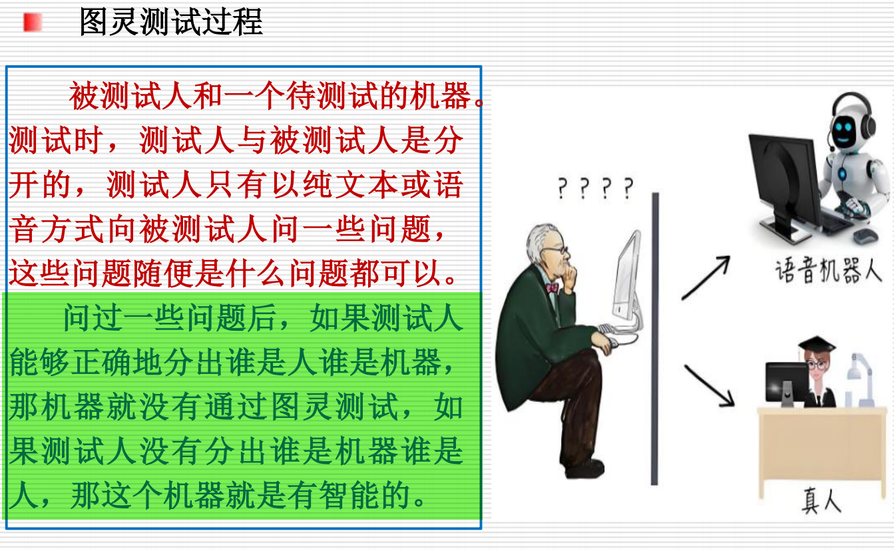
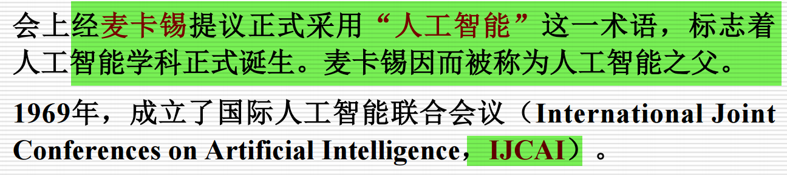
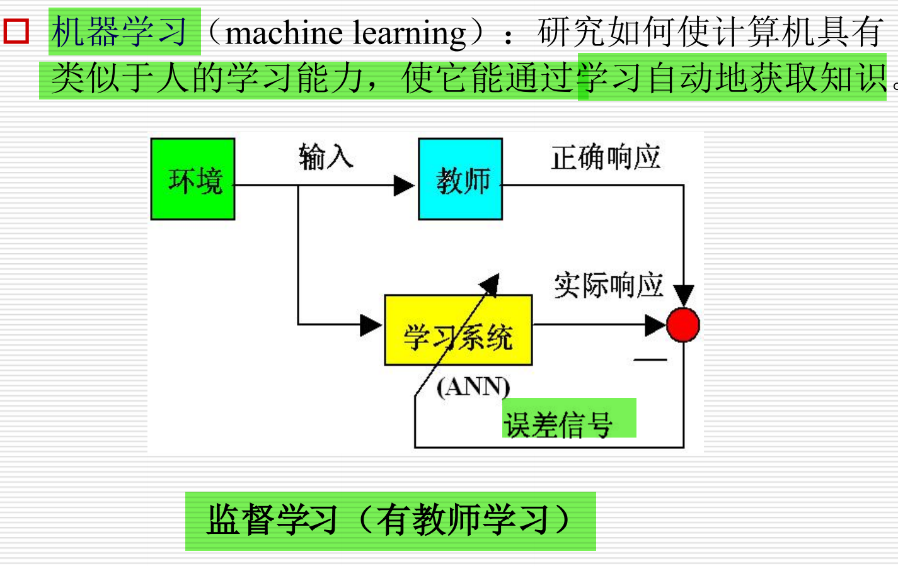
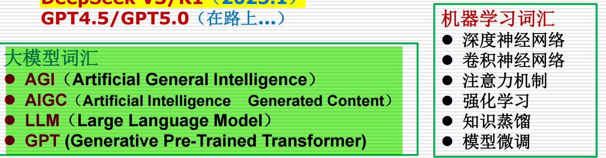

# 绪论

## 图片示例

---

## 1. AGI（Artificial General Intelligence）

人工通用智能（AGI）是指一种具备通用智能的人工智能系统，能够理解、学习并执行任何智能任务。与当前的人工狭义智能（Narrow AI）不同，AGI 不仅限于执行某些特定的任务（如语音识别、图像分类等），而是具备像人类一样的灵活性和适应能力。

AGI 目标是创建一种具有普遍智慧的系统，能够在各个领域中进行思考、推理、学习和解决问题，这种系统可以进行跨领域的任务处理，而不局限于某一特定领域。

---

## 2. AIGC（Artificial Intelligence Generated Content）

人工智能生成内容（AIGC）是指通过人工智能技术（尤其是大模型）自动生成的内容。内容可以是文本、图像、音频、视频等多种形式。

AIGC 的典型应用包括自动生成新闻报道、AI绘画、智能音乐创作等。随着大语言模型（如 GPT 系列）的发展，AIGC 已成为热门的研究和应用领域，尤其在内容创作和媒体行业中表现出巨大的潜力。

---

## 3. LLM（Large Language Model）

大语言模型（LLM）指的是一种基于深度学习的语言处理模型，拥有大量的参数和训练数据。大语言模型通常用于自然语言处理任务，如语言翻译、文本生成、问答系统、对话生成等。

LLM 的一个典型例子是 GPT（Generative Pre-trained Transformer）系列。由于其庞大的参数规模和多样的应用场景，LLM 成为当前人工智能领域的重要组成部分。

---

## 4. GPT（Generative Pre-trained Transformer）

生成预训练变换器（GPT）是由 OpenAI 开发的一系列大语言模型，具有强大的生成能力。GPT 模型是基于 Transformer 架构的，首先通过大量的无监督学习进行预训练，然后通过有监督学习或强化学习进行微调，以完成特定任务。

GPT 模型可以生成自然流畅的文本，能够回答问题、写文章、进行对话等。GPT-3、GPT-4 等是目前最知名的版本，凭借其庞大的参数规模和高效的生成能力，已经在许多领域取得了显著的应用.