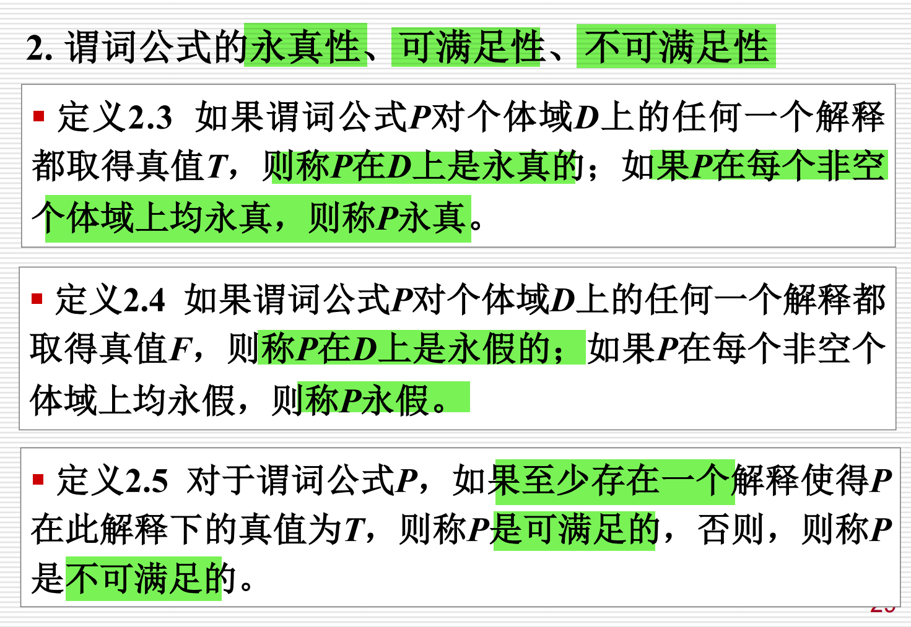

1. P规则
定义：在推理的任何步骤中都可以引入前提，前提是直接在推理中给定的。

含义：任何时候，如果前提（给定的条件）被明确表示，可以直接使用这个前提进行推理。例如，如果已知“如果下雨，地面会湿”，可以在推理过程中直接使用“下雨”作为前提。

2. T规则
定义：在推理过程中，如果前面步骤中有一个公式永远为真（如逻辑公式S），则可以把S引入推理中。

含义：如果某个公式在逻辑上是永远成立的（无论其它条件如何），则可以引入该公式进行推理。比如，如果我们知道某个数学公式或命题在所有情况下都为真（例如“2+2=4”），那么在推理过程中就可以直接使用这个公式。

3. CP规则
定义：如果能够从任何引入的命题R和前提集合中推导出一个结论S，则可以在前提集合中加入R并继续推理。

含义：如果你可以通过某个命题R推导出结论S，那么你可以将命题R加入到推理的前提集中，并继续进行后续推理。例如，如果你知道从“下雨”可以推导出“地面湿滑”，那么你可以在推理过程中将“下雨”作为新的前提引入。

