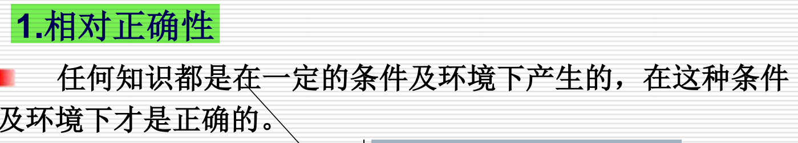

知识的三个关键特性：相对正确性、不确定性、以及可表示性和可利用性。下面是这三点的详细总结：

1. 相对正确性
定义：知识的正确性是相对的，而非绝对的。即知识只有在特定的条件和环境下才是正确的。它依赖于特定的前提和背景，因此不能被认为是普适的或固定不变的。

2. 不确定性
定义：知识通常具有不确定性，表现为以下几种类型：

随机性引起的不确定性：随机性导致的不可预测性，通常通过概率来衡量。例如，在物理实验中，由于随机扰动导致的测量不确定性。

模糊性引起的不确定性：信息不够精确或缺乏清晰的界定，导致理解上的不确定性。例如，语言中的模糊性使得对某些现象的描述或理解存在不确定性。

经验引起的不确定性：知识源于经验，而经验有时并不完美。因此，基于历史经验的推断或判断往往存在不确定性，因为不同的环境下经验可能不完全适用。

不完全性引起的不确定性：当知识体系不完全或缺少关键信息时，推理的结果也会存在不确定性。这种不确定性是由于信息的缺失或知识的不完整导致的。

3. 可表示性和可利用性
可表示性：知识可以以不同的方式表示。例如，文字、符号、图像、图表、甚至神经网络等都可以作为知识的表示方式。表示方式的选择依赖于具体的应用场景和任务需求。

可利用性：不仅知识可以被表示，它还必须能够被利用，帮助做出决策或解决实际问题。可利用性强调了知识在实际应用中的作用——它不仅是抽象的概念，还能够通过某种形式被应用到实际操作中。

这部分强调了调词公式（通常与语言学、数学、物理学等领域相关）如何在一个体域内进行解释。也就是说，调词公式的实际意义和应用是通过与某一具体领域的常量、变量、函数等符号的结合来理解的。

P规则（前提引入）：允许直接引入已知的前提作为推理的起点。

T规则（假言推理）：允许根据已知的公理、定理或事实进行推理，推导出新的结论。

CP规则（附加前提引入）：如果能从某些命题中推导出另一个命题，则可以将该命题作为新的前提加入进来，并进行进一步推理。

