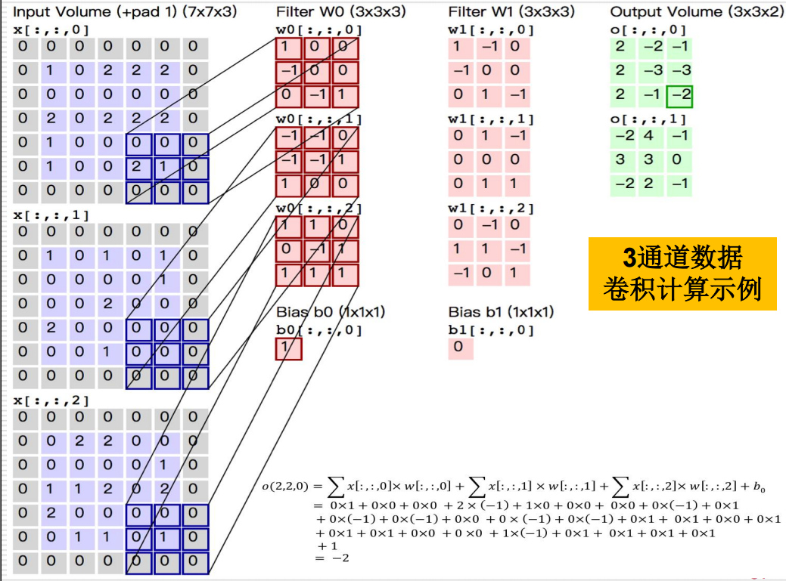
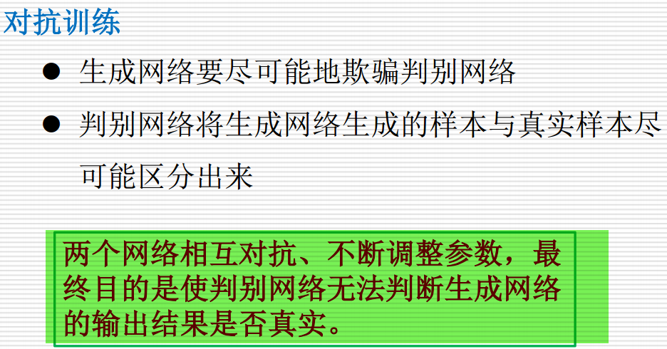

这张图展示的是 **生成对抗网络（GANs）** 的损失函数和相关的优化过程。生成对抗网络由两个主要部分组成：**生成器（Generator）** 和 **判别器（Discriminator）**，它们通过一个“对抗”过程进行训练。在该过程里，生成器试图生成逼真的数据，而判别器则试图区分生成的数据和真实的数据。

我们来逐步解释图中的内容：

### 1. 判别器（Discriminator）

判别器的目标是区分真实数据和生成的数据。其损失函数的表达式为：

```
max_φ E_{x~p_r(x)} [log D(x; φ)] + E_{z~p_z(z)} [log(1 - D(G(z; θ); φ))]
```

- `x`：真实数据，来自真实数据分布 `p_r(x)`。
- `z`：从潜在空间中采样的噪声，来自分布 `p_z(z)`。
- `G(z; θ)`：生成器生成的样本。
- `D(x; φ)`：判别器对样本 `x` 判断其为真实的概率（输出为0到1之间的值）。
- `φ`：判别器的参数。
- `θ`：生成器的参数。

判别器的目标是最大化两个期望：
- 第一项：判别器正确分类真实数据的概率，即 `D(x)` 应该尽可能接近1。
- 第二项：判别器正确将生成数据分类为假的概率，即 `D(G(z))` 应该尽可能接近0。

### 2. 生成器（Generator）

生成器的目标是生成尽可能真实的数据，欺骗判别器，使判别器无法区分生成的假数据和真实数据。其损失函数的表达式为：

```
max_θ E_{z~p_z(z)} [log D(G(z; θ); φ)]
```

生成器的目标是最大化 `D(G(z))`，即希望判别器把生成的数据 `G(z)` 识别为真实数据。因此，生成器通过反向传播调整参数 `θ` 来最大化判别器给出的“真实”概率。

### 3. 对抗训练（Minimax Game）

生成对抗网络的训练可以通过一个博弈过程（minimax game）来描述，其中：

- **生成器（Generator）** 和 **判别器（Discriminator）** 处于对抗状态。生成器的目标是最大化其损失（欺骗判别器），而判别器的目标是最小化其损失（正确区分真假数据）。

生成器和判别器的损失可以写作：

```
min_φ max_θ [ E_{x~p_r(x)} [log D(x; φ)] + E_{z~p_z(z)} [log(1 - D(G(z; θ); φ))] ]
```

这个过程的本质是一个 **最小化-最大化博弈**：
- 判别器试图最小化其对抗损失，即提高自己区分真实和假数据的能力。
- 生成器试图最大化其损失，即通过生成更加逼真的数据来欺骗判别器。

### 4. 总结

- **生成器** 通过调整其参数 `θ`，生成尽可能真实的数据，使得判别器无法区分生成的数据与真实数据。
- **判别器** 通过调整其参数 `φ`，最大化正确分类真实数据和生成数据的概率。
- 通过这种“对抗”训练，生成器和判别器不断提升自己的能力，最终生成器能够生成非常接近真实数据的样本，而判别器则变得更加精确。

这些方程式和“最小化-最大化”博弈过程构成了GAN训练的核心。

