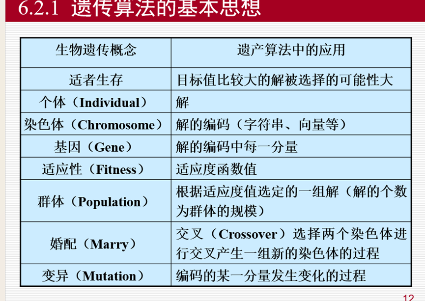

2024-2021届人工智能导论考题复盘： 选择：2018谁得图灵奖因卷积的突出贡献，蛋白质预测结构的模型是，不确定性推理的定义（那俩不确定..） 卷积的简单计算，卷积和全连接层混到一起使用的好处、卷积相较于全连接的优势，把灰度图转为三通道rgb会有哪些影响
gan：原理、图示、训练过程、缺陷、对社会的危害 逻辑式中的蕴含式和产生式的区别，举例
A*算法：填充open、close表、画搜索流程图 遗传算法

整张表右侧的填充...
bp的目的，bp的流程
