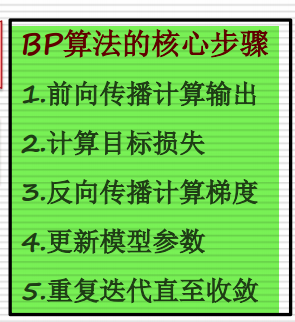
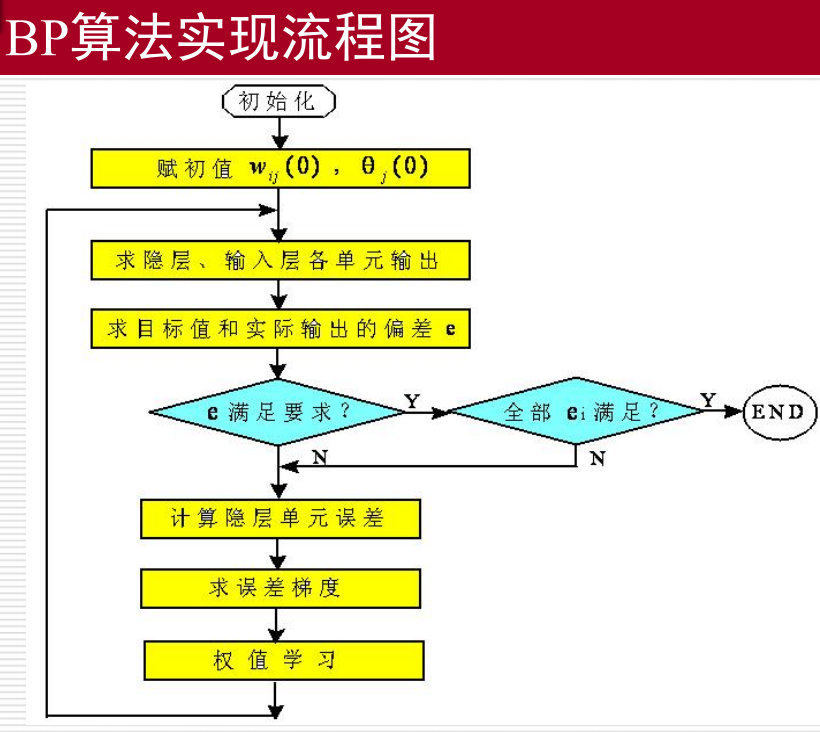

1. **历史**
- 2018年，图灵奖（计算机科学的诺贝尔奖）授予了三位深度学习领域的先驱：Geoffrey Hinton、Yoshua Bengio 和 Yann LeCun，被誉为“深度学习的教父”。
- **Yann LeCun**：提出卷积神经网络（CNN）概念，并在1998年应用于手写数字识别，推动了图像识别技术发展。
- **Geoffrey Hinton**：提出反向传播算法（backpropagation），开发玻尔兹曼机（Boltzmann Machine），为深度学习提供理论基础。
- **Yoshua Bengio**：在生成对抗网络（GAN）、序列建模、注意力机制等方面有重要贡献，推动自然语言处理和生成模型发展。

    
    

2. **AIGC**
- AIGC（人工智能生成内容，Artificial Intelligence Generated Content）指通过AI模型自动生成文本、图像、音频、视频等内容，使内容创作更高效、个性化，广泛应用于各行业。

3. **逻辑式中的蕴含式和产生式的区别**
    

4. **A*算法**
- 适用条件：
    
    
- open表和close表作用：
    
    
    
- 算法流程图：
    
    
- open表和close表内容节点变化：
    
    

5. **CNN**
- 卷积计算：
    
    > 参考：[torch.nn.Conv2d](https://pytorch.org/docs/stable/generated/torch.nn.Conv2d.html)
    - 输出尺寸计算公式：L' = [ (L+2p-k)/s +1]（下取整）
- 卷积和全连接混用优势：
    - 参数共享：卷积层共享卷积核参数，减少参数数量和计算复杂度。
    - 局部连接：卷积层连接局部区域，捕捉局部特征，增强空间不变性。
    - 全局信息整合：全连接层整合全局信息，实现高层次特征组合和分类。
    - 提高泛化能力：结构结合有助于提升泛化能力，减少过拟合。
- 输入通道变化：
    - 单通道（灰度图）变为三通道（RGB）时，卷积核深度变为3，形状为3×3×3（高×宽×通道），每个卷积核与三个通道卷积。
- 卷积操作优势：
    - 局部感知、参数共享、空间不变性、特征层次化。

6. **遗传算法**
    

7. **BP算法**
- 目的：通过最小化输出误差和损失函数，反向调整神经网络权重和偏置，实现输入与输出的映射学习。
- 流程：
    
    

8. **GAN**
- 原理：
    
    
    
    
    - GAN由生成器（Generator）和判别器（Discriminator）组成，通过对抗训练，生成器生成逼真数据，判别器区分真假数据，最终生成器能生成与真实数据难以区分的样本。
- 具体流程：
    1. 随机初始化生成器和判别器参数。
    2. 生成器从潜在空间采样噪声，生成假数据。
    3. 判别器接收真实和生成数据，判断真假。
    4. 计算损失，优化参数。
    5. 迭代训练，提升生成器和判别器性能。
- 缺点：
    
- 可能危害：
    - 虚假信息传播、隐私泄露、版权问题、道德伦理争议（如深度伪造）。

9. **不确定性推理的定义**
- 不确定性推理是在信息不完全或有噪声时，利用概率、模糊逻辑等方法进行推断和决策的过程。
