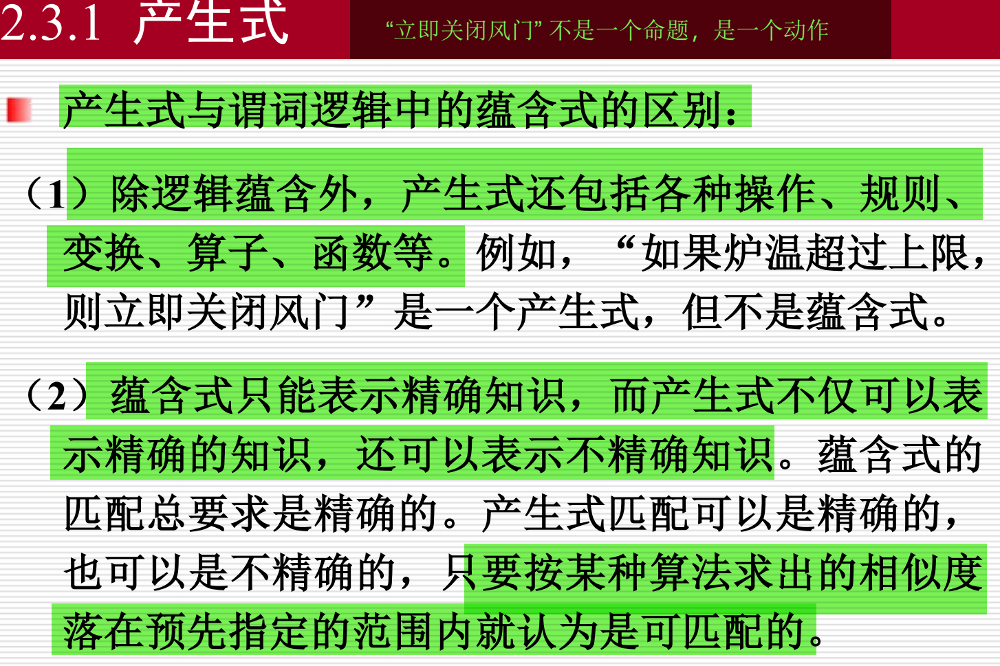

1. 历史：

2018年，图灵奖（被誉为计算机科学的诺贝尔奖）授予了三位人工智能领域的先驱：Geoffrey Hinton、Yoshua Bengio 和 Yann LeCun。​他们被誉为“深度学习的教父”，因其在深度神经网络领域的理论和工程突破性贡献，推动了计算机视觉、语音识别等领域的革命性进展。​

其中，Yann LeCun 因其在卷积神经网络（CNN）方面的开创性工作而获得特别认可。​他在1980年代提出了卷积神经网络的概念，并在1998年成功应用于手写数字识别任务，显著提升了识别准确率。​这一贡献为图像识别技术的发展奠定了基础。​

Geoffrey Hinton 的主要贡献包括提出反向传播算法（backpropagation），使得多层神经网络的训练成为可能，并开发了玻尔兹曼机（Boltzmann Machine）等模型。​这些工作为深度学习的兴起提供了理论支持。​

Yoshua Bengio 在深度学习领域的研究涵盖了生成对抗网络（GAN）、序列建模、注意力机制等方面，为自然语言处理和生成模型的发展做出了重要贡献。

2. AIGC
AIGC（人工智能生成内容，Artificial Intelligence Generated Content）是指通过人工智能模型自动生成的内容，涵盖文本、图像、音频、视频等多种形式。​这一技术使得内容创作变得更加高效、个性化，并在多个行业中得到广泛应用。

3. **逻辑式中的蕴含式和产生式的区别**  

4. **A*算法**  
- 适用A*算法的条件：

- open表和close表的作用：

- A*算法的流程图：

- open表和close表的内容节点变化：

<!-- 
1. **不确定性推理的定义**  
    不确定性推理是指在信息不完全或存在噪声的情况下，利用概率、模糊逻辑等方法进行推断和决策的过程。

2. **卷积的简单计算**  
    卷积操作是将卷积核在输入数据上滑动，通过对应元素相乘再求和得到输出特征。  
    例如：输入为`[1, 2, 3]`，卷积核为`[1, 0]`，则输出为`[1*1+2*0, 2*1+3*0] = [1, 2]`。

3. **卷积和全连接层混合使用的好处**  
    卷积层能提取局部特征，减少参数量；全连接层有助于整合全局信息。混合使用可以兼顾特征提取和信息整合，提高模型表现。

4. **卷积相较于全连接的优势**  
    - 参数更少，计算效率高  
    - 能提取空间局部特征  
    - 更易泛化，减少过拟合

5. **把灰度图转为三通道RGB的影响**  
    仅复制灰度值到三个通道不会增加信息量，但可兼容需要三通道输入的模型。不会提升识别效果，但可用于迁移学习等场景。

6. **GAN（生成对抗网络）**  
    - 原理：由生成器和判别器组成，生成器生成假样本，判别器区分真假，二者对抗训练。  
    - 图示：通常为两个网络结构对抗。  
    - 训练过程：交替优化生成器和判别器。  
    - 缺陷：训练不稳定、模式崩溃、难以收敛。  
    - 社会危害：可用于伪造图片、音频、视频，带来安全和伦理风险。

9. **遗传算法**  
    通过选择、交叉、变异等操作模拟自然进化，逐步优化解空间，常用于全局优化问题。
    

10. **BP（反向传播）算法**  
     - 目的：通过误差反向传播调整神经网络权重，最小化损失函数。  
     - 流程：前向传播计算输出，计算损失，反向传播误差信号，更新权重。 -->
