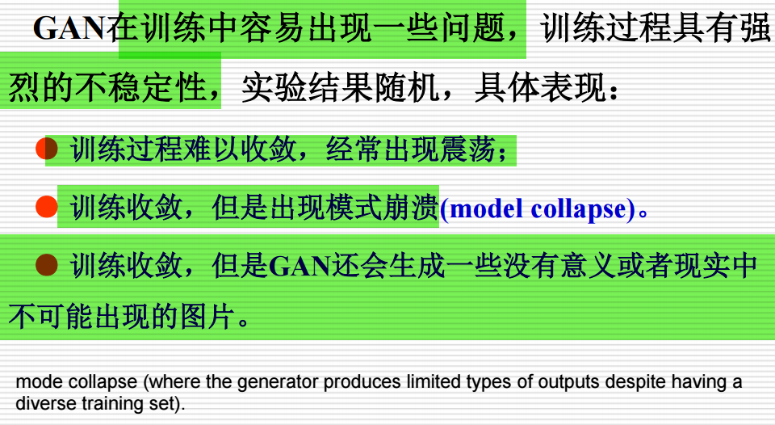

# 考题复盘

---

## 1. 历史

2018年，图灵奖（被誉为计算机科学的诺贝尔奖）授予了三位人工智能领域的先驱：Geoffrey Hinton、Yoshua Bengio 和 Yann LeCun。​他们被誉为“深度学习的教父”，因其在深度神经网络领域的理论和工程突破性贡献，推动了计算机视觉、语音识别等领域的革命性进展。​

- **Yann LeCun**：卷积神经网络（CNN）开创性工作，1980年代提出CNN概念，1998年应用于手写数字识别，提升了识别准确率，为图像识别技术发展奠定基础。
- **Geoffrey Hinton**：提出反向传播算法（backpropagation），开发玻尔兹曼机（Boltzmann Machine）等模型，为深度学习兴起提供理论支持。
- **Yoshua Bengio**：研究涵盖生成对抗网络（GAN）、序列建模、注意力机制等，为自然语言处理和生成模型发展做出重要贡献。

---

## 2. AIGC

AIGC（人工智能生成内容，Artificial Intelligence Generated Content）是指通过人工智能模型自动生成的内容，涵盖文本、图像、音频、视频等多种形式。​这一技术使得内容创作变得更加高效、个性化，并在多个行业中得到广泛应用。

---

## 3. 逻辑式中的蕴含式和产生式的区别

---

## 4. A*算法

### 适用A*算法的条件

### open表和close表的作用

### A*算法的流程图

### open表和close表的内容节点变化

---

## 5. CNN

### 卷积计算

> https://pytorch.org/docs/stable/generated/torch.nn.Conv2d.html

L' = [ (L+2p-k)/s +1]（下取整）

### 卷积和全连接混用的优势

- **参数共享**：卷积层通过共享卷积核参数，显著减少了模型的参数数量，降低了计算复杂度。
- **局部连接**：卷积层仅连接局部区域，能够捕捉局部特征，增强模型的空间不变性。
- **全局信息整合**：全连接层能够整合全局信息，进行高层次的特征组合和分类。
- **提高泛化能力**：结合卷积层和全连接层的结构，有助于提高模型的泛化能力，减少过拟合风险。

### 输入通道从单通道变为三通道时的参数变化

当输入图像从单通道（灰度图）变为三通道（RGB图像）时，卷积核的参数会相应变化：

- **卷积核尺寸**：保持不变，例如3×3。
- **卷积核数量**：根据需要提取的特征数量确定，例如64个卷积核。
- **卷积核深度**：与输入通道数相同，对于RGB图像为3。

因此，卷积核的形状将变为3×3×3（高度×宽度×输入通道数），每个卷积核会与输入图像的三个通道进行卷积操作。

### 卷积操作在CNN中的优势

- **局部感知**：卷积操作能够捕捉图像中的局部特征，如边缘、角点等。
- **参数共享**：通过共享卷积核参数，减少了模型的参数数量，降低了计算复杂度。
- **空间不变性**：卷积操作具有平移不变性，能够识别不同位置的相同特征。
- **特征层次化**：通过多层卷积操作，逐步提取从低级到高级的特征。

---

## 6. 遗传算法

---

## 7. BP算法

### 目的

BP算法的主要目的是通过最小化输出误差和最小化损失函数，反向调整神经网络中的权重和偏置，使网络能够学习输入与输出之间的映射关系。

### 流程

---

## 8. GAN

### 原理

GAN的原理  
GAN由两个主要的神经网络组成：生成网络（Generator）和判别网络（Discriminator）。这两个网络在训练过程中相互对抗，最终实现生成器能够生成与真实数据非常相似的样本。

- **生成网络（Generator）**：从一个随机的潜在空间（latent space）采样数据（通常是随机噪声），并通过神经网络生成假的数据（例如，图像）。生成网络的目标是尽可能生成与真实数据相似的样本。
- **判别网络（Discriminator）**：接收输入数据（无论是真实数据还是生成器生成的假数据），并将其分类为“真实”或“假”。判别器的目标是尽可能准确地区分真实和生成的样本。

#### GAN的工作流程

1. **生成网络（Generator）**：
   - 生成网络从一个潜在空间（latent space）中随机采样（通常是噪声）作为输入，通过神经网络生成一张假的图像或数据。
   - 生成器的目标是通过调整其参数，使生成的数据越来越像真实数据。

2. **判别网络（Discriminator）**：
   - 判别器的输入是图像数据（无论是真实的还是生成器生成的），判别器的任务是判断这个图像是真实的还是由生成器生成的。
   - 判别器的目标是尽可能准确地将真实图像和生成的假图像区分开来。

3. **对抗训练（Adversarial Training）**：
   - 生成器和判别器通过一个零和博弈进行训练，生成器试图欺骗判别器，而判别器试图正确分类真实数据和生成数据。
   - 生成器通过反馈调整其生成的数据，使得判别器难以区分真实和生成的数据。
   - 判别器也会调整其策略，以便能够更准确地区分生成数据和真实数据。
   - 最终，训练的目标是使得生成器能够生成足够逼真的数据，以至于判别器无法准确区分。

#### 具体流程

- **初始化**：随机初始化生成器和判别器的参数。
- **生成数据**：生成器从潜在空间（latent space）中采样噪声数据，生成一个假的图像或数据。
- **判别数据**：判别器接收生成的数据和真实数据，进行分类判断是“真实”还是“假”。
- **计算损失**：判别器计算其损失（例如，使用交叉熵损失函数），评估其对真实数据和生成数据的分类准确性。生成器也计算损失，反映其生成数据被判别器分类为假数据的程度。
- **优化**：生成器通过反向传播优化其参数，减少生成数据被判定为假的概率。判别器通过反向传播优化其参数，减少对假数据的误分类。
- **迭代训练**：通过不断迭代训练，生成器和判别器在对抗中不断提高性能。最终，生成器能够生成非常逼真的数据，判别器则变得难以区分真实与生成的数据。

### 缺点

### 可能造成的危害

GAN的强大生成能力也带来了一些潜在的危害：

- **虚假信息传播**：生成的虚假图像或视频可能被用于制造假新闻或误导公众。
- **隐私泄露**：生成的个人信息可能被用于非法目的。
- **版权问题**：生成的内容可能侵犯他人版权。
- **道德伦理问题**：生成的内容可能引发伦理争议，如深度伪造（Deepfake）技术的滥用。

---

## 9. 不确定性推理的定义

不确定性推理是指在信息不完全或存在噪声的情况下，利用概率、模糊逻辑等方法进行推断和决策的过程.
